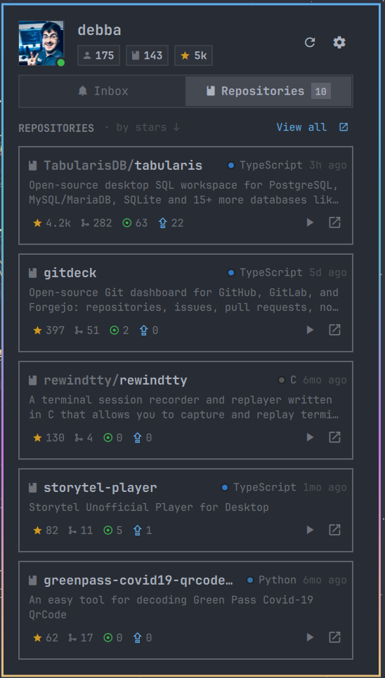

# GitHub Tray for Omarchy

Your GitHub account in the Omarchy bar: unread notifications, repositories, issues, pull requests and Actions runs, one click away.

This is a port of my [GitHub Tray GNOME extension](https://github.com/debba/github-tray-gnome-extension) to Omarchy's Quickshell-based bar. Same idea, rebuilt with the shell's own UI kit so it follows your theme, font and corner radius.

<p align="center">
  
</p>

## What it does

- Shows an unread badge on the bar icon and a desktop notification when something new comes in
- **Inbox** tab: unread notifications with type, state (open / merged / draft), reason and age. Click to open and mark as read, or mark as read without opening
- **Repositories** tab: your own, collaborator and organization repos with language, stars, forks, open issues and PRs. Issues and PRs open inline; every repo has a shortcut to its workflow runs
- **Actions**: last runs per repository with status, branch and duration; failed or cancelled runs can be re-run from the panel
- **Local projects**: map `owner/repo` to a folder on disk and the repo card opens it in your editor instead of the browser. Mapped repos also get workflow notifications (started, succeeded, failed, cancelled)
- Works with github.com and GitHub Enterprise Server

Keyboard: `r` refresh · `s` settings · `o` open on GitHub · `1` / `2` switch tabs · `Esc` back or close. Middle-click the bar icon to refresh.

<details>
<summary>Short demo</summary>


</details>

## Install

```bash
omarchy plugin add https://github.com/debba/omarchy-github-tray --enable
```

Then click the GitHub icon in the bar, open Settings and enter your username and a classic personal access token. The token needs the `repo` scope (or `public_repo` if you only care about public repositories). Everything else is optional.

You can also reach the settings from the shell's bar widget settings, or via IPC:

```bash
omarchy-shell community.github-tray settings
```

### Running from a checkout

```bash
git clone https://github.com/debba/omarchy-github-tray
cd omarchy-github-tray
./install.sh      # symlinks the plugin into ~/.config/omarchy/plugins and enables it
./uninstall.sh    # removes the symlink and disables it
```

The backend is a single Python script (`scripts/github-tray`) that talks to the GitHub REST and GraphQL APIs with the standard library only, so there is nothing else to install.

## Settings

| Setting | Notes |
| --- | --- |
| Username, token, Enterprise URL | Leave the URL empty for github.com |
| Bar section, font size | Where the icon sits and how large the panel text is |
| Sort by, order, max repositories | Updated / pushed / created / stars / name |
| Editor command | Used to open mapped repositories, e.g. `code`, `zeditor`, `nvim` |
| Repository mappings | `owner/repo` → local path; `~` is expanded |
| Notifications | Toggle the inbox, desktop alerts, refresh interval and which reasons are included |
| GitHub Actions | How many runs to list and which state changes to notify about |

## IPC

```bash
omarchy-shell community.github-tray toggle
omarchy-shell community.github-tray refresh
omarchy-shell community.github-tray settings
```

## Notes

- Repository data is cached in `~/.local/state/omarchy-github-tray/state.json` to detect new stars, forks, followers and notifications between refreshes.
- Repositories refresh every five minutes; notifications follow the interval you set (60 s by default).
- The token is stored in Omarchy's `shell.json` together with the other widget settings.

## License

MIT
